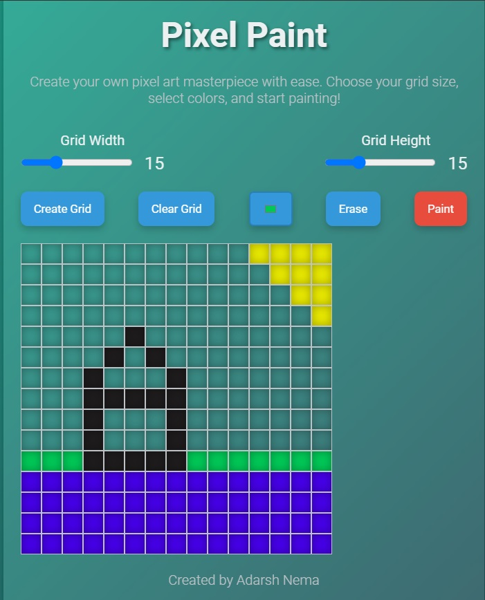

# Pixel Paint 



## Created by Adarsh Nema

Welcome to the Pixel Paint Project ! This web application allows you to create pixel art masterpieces with ease. Customize your grid size, choose your colors, and start painting. Clear the grid to start fresh, and switch between paint and erase modes to perfect your artwork.

## Features

- **Responsive Grid Creation:** Adjust the grid dimensions to fit your desired canvas size.
- **Color Picker:** Select any color to paint your pixels.
- **Paint and Erase Modes:** Switch between painting and erasing for precise control over your artwork.
- **Clear Grid:** Clear the grid to start a new creation.
- **Touch and Mouse Support:** Compatible with both touch and mouse devices for a seamless experience.
- **Modern Design:** Stylish and futuristic UI with smooth animations and transitions.


## Getting Started

### Prerequisites

You need a modern web browser to run this project.

### Installation

1. Clone the repository:

    ```bash
    git clone https://github.com/NemaAdarsh/Pixel-Paint.git
    ```

2. Navigate to the project directory:

    ```bash
    cd Pixel-Paint
    ```

3. Open `index.html` in your web browser to start the application.

## Usage

1. **Set Grid Dimensions:** Use the sliders to adjust the width and height of the grid. The values will be displayed next to the sliders.
2. **Create Grid:** Click the "Create Grid" button to generate the grid.
3. **Select Color:** Use the color input to choose your painting color.
4. **Paint Mode:** Click the "Paint" button to enable painting. Click on the grid cells to color them.
5. **Erase Mode:** Click the "Erase" button to enable erasing. Click on the grid cells to remove the color.
6. **Clear Grid:** Click the "Clear Grid" button to clear the entire grid and start over.

## Code Structure

- `index.html`: The main HTML file that contains the structure of the application.
- `style.css`: The CSS file that styles the application with a modern and futuristic look.
- `index.js`: The JavaScript file that adds interactivity to the application, handling grid creation, painting, and erasing.

## Contributing

Contributions are welcome! Please follow these steps to contribute:

1. Fork the repository.
2. Create a new branch (`git checkout -b feature-branch`).
3. Commit your changes (`git commit -m 'Add some feature'`).
4. Push to the branch (`git push origin feature-branch`).
5. Open a pull request.
